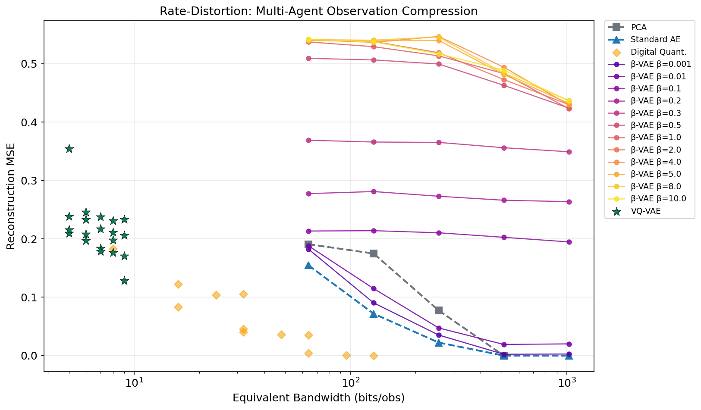
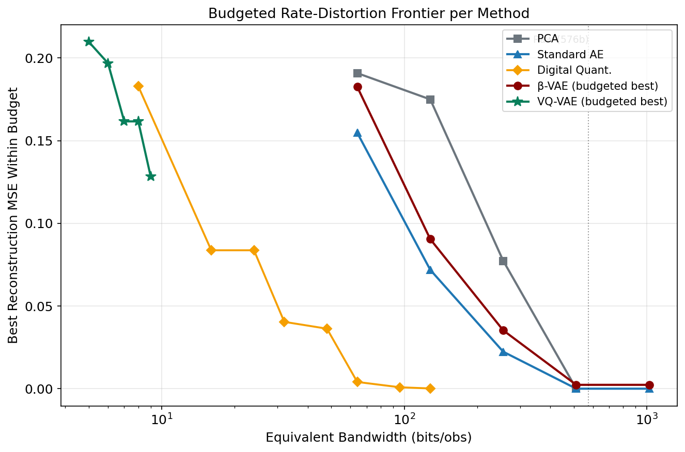
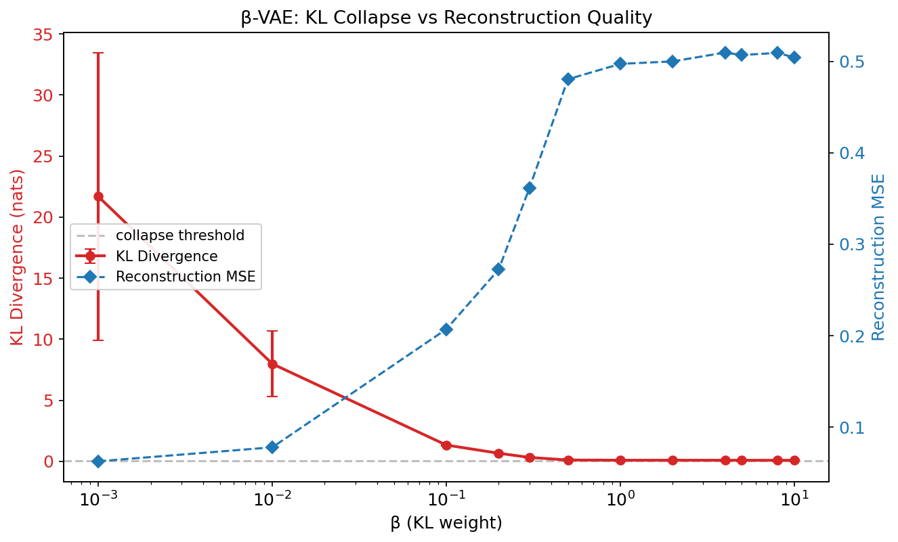
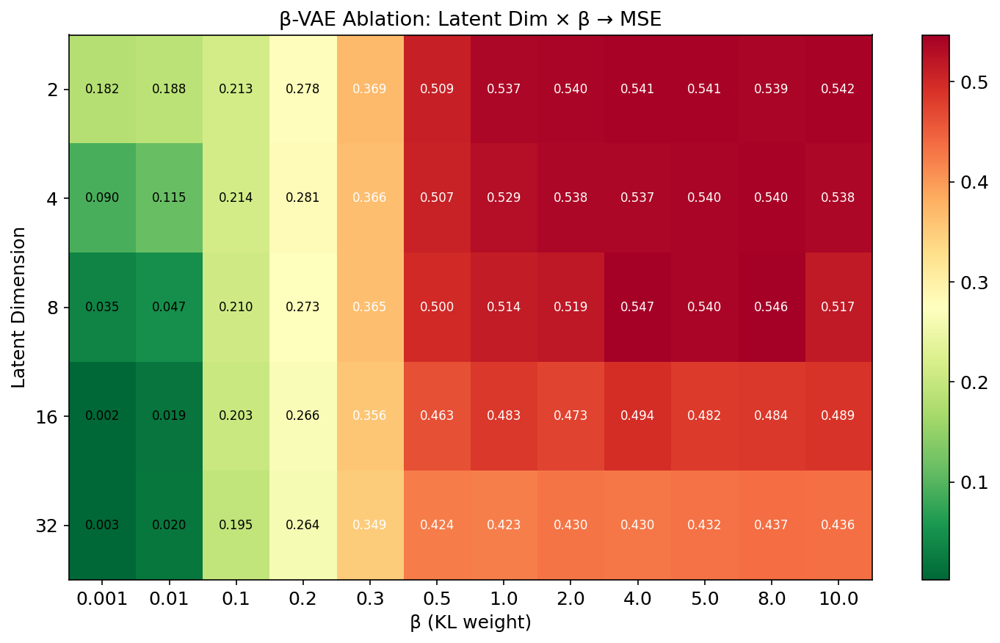
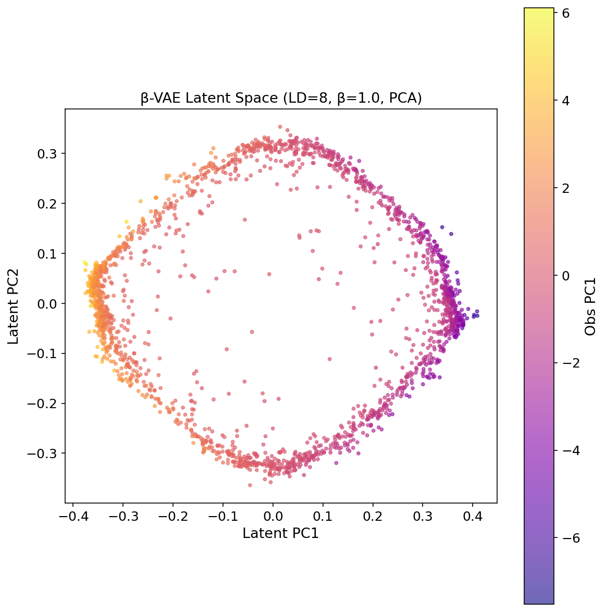
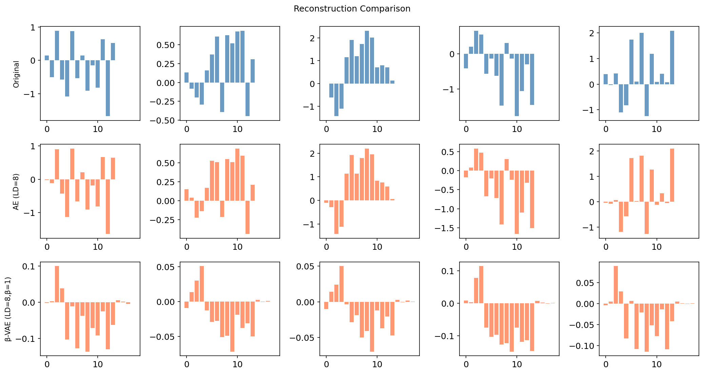
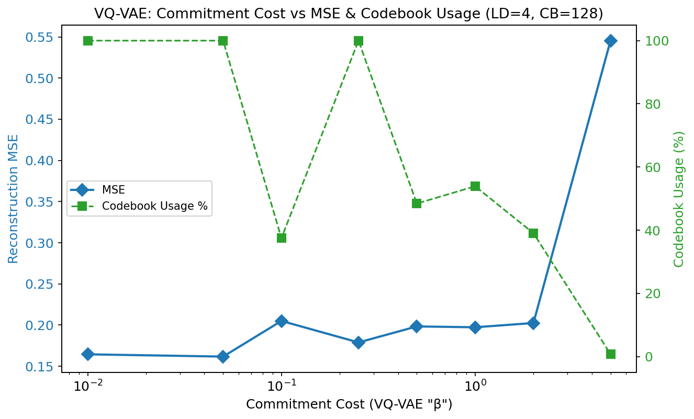
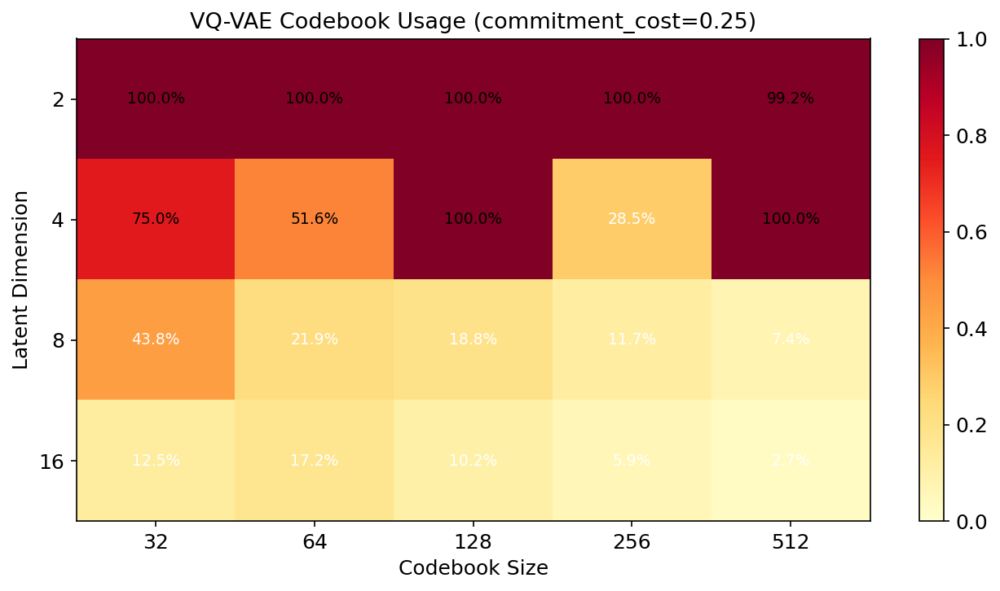

# ObsCodec: Learned Observation Compression for Multi-Agent Systems

> A compact research demo for semantic communication in embodied multi-agent
> coordination.

[](https://www.python.org/)
[](https://pytorch.org)
[](LICENSE)
[](README_zh.md)

## TL;DR

ObsCodec asks a simple question: **how much of a robot observation must be
communicated before task-relevant structure disappears?**

The repository benchmarks five codec families on observations collected from
PettingZoo/MPE `simple_spread_v3`. The current artifact contains benchmark
configurations across PCA, Autoencoder, Digital, β-VAE, and VQ-VAE codecs.

| Result | Evidence | Why It Matters | See |
|--------|----------|----------------|-----|
| Digital quantization is the strongest reconstruction baseline | MSE ≤ 0.0001 at 128 nominal bits | Upper reference for pure observation fidelity | Table 1, Fig. rate_distortion |
| β-VAE exposes a tunable semantic information rate | β=0.01 yields a tight semantic bottleneck; KL spans 300× range (19.6→0.06 nats) across β sweep | SemCom: rate measured by information bottleneck with proper encoder-decoder balance | Table 2, Fig. ablation_heatmap |
| Effective collapse at β ≥ 0.5 (KL at free-bits floor) | KL ~0.06–0.09 nats (~0.1 bits), MSE → 0.55 (data variance) at β≥0.5; free_bits=0.01 allows wide dynamic range | Practical threshold: KL at floor = < 0.1 effective bits | Table 2, Fig. kl_collapse |
| VQ-VAE with EMA achieves best at LD=4 | Best: CB=512, LD=4, 9 bits, MSE=0.1283, 100% codebook usage | Discrete packet alternative with high codebook utilization | Table 3, Fig. vqvae_usage_heatmap |

Full numbers are in [assets/results_summary.md](assets/results_summary.md).

## Why This Repo Exists

Multi-robot systems often operate under communication constraints: underwater
robots, disaster-response teams, warehouse fleets, and contested or low-bandwidth
field environments. Raw observation sharing is wasteful; semantic communication
should transmit the information that helps agents coordinate.

ObsCodec is a pre-study before integrating codecs into a full MARL loop. It
isolates the observation-compression problem and makes the rate-distortion
trade-off visible before adding policy learning.

This makes the project a focused demo for:

- **Semantic communication**: β-VAE gives an explicit KL-based information rate.
- **Multi-agent systems**: data comes from multi-agent particle-world observations.
- **Embodied intelligence**: the signal is a robot-like observation vector, not a
  static image benchmark.
- **Research engineering**: all codec families share the same train/validation/test
  protocol and result-generation scripts.

## Methods

| Method | Role | Bandwidth Control | Grid |
|--------|------|-------------------|------|
| PCA | Linear baseline | `n_components` | 4 fits |
| Standard AE | Nonlinear reconstruction baseline | `latent_dim` | 5 runs |
| Digital quantization | Traditional fixed-bit baseline | `latent_dim x bits_per_dim` | 12 runs |
| β-VAE | Probabilistic semantic bottleneck | `latent_dim x β` | 40 runs |
| VQ-VAE | Discrete codebook bottleneck | `codebook_size x latent_dim x commitment_cost` | 27 unique runs |

All neural codecs use the shared trainer in
[obscodec/trainer.py](obscodec/trainer.py), with early stopping and identical
data splits.

## Key Figures

### Rate-Distortion Overview

<p align="center">
  
</p>

**Digital dominates pure reconstruction; β-VAE traces the information bottleneck frontier.**
The digital baseline achieves the best MSE at 128+ nominal bits when reconstruction is the only
objective. β-VAE is central for semantic communication because it measures an **effective
information rate** through KL divergence, letting us study where the latent channel becomes
semantically empty. With free_bits=0.01 nats/dim, the KL spans a 300× dynamic range from
β=0.001 to β=0.5 before reaching the floor, after which MSE approaches the data variance
(~0.545) as theory predicts. (Data: Table 1, Table 2.)

### Budgeted Frontier

<p align="center">
  
</p>

**The frontier is a design map for codec selection under bandwidth constraints.**
Digital quantization is the choice for high-fidelity observation replay; β-VAE is the
tool for information-bottleneck studies where effective rate matters more than raw MSE;
VQ-VAE serves when a discrete, low-bitrate channel interface is more important than
reconstruction accuracy. (Data: Table 1, Table 4.)

### β-VAE Collapse Boundary

<p align="center">
  
  
</p>

**KL spans 300× dynamic range, reaching the free-bits floor at β ≥ 0.5.**
With the corrected architecture (balanced encoder-decoder capacity, BatchNorm encoder, KL
annealing over 50 warmup epochs, free-bits=0.01 nats/dim), the posterior never collapses to
zero KL. From β=0.001 (KL≈19.6 nats, 28 bits) to β=0.5 (KL≈0.09 nats, 0.1 bits), the KL
declines smoothly across two orders of magnitude. At β ≥ 0.5, KL reaches the per-dimension
free-bits floor and MSE approaches the data variance (~0.545), consistent with the
theoretical β→∞ limit. This is a dramatic improvement over both the old architecture
(without free bits or annealing, KL<10⁻⁴ at β≥0.5) and the intermediate fb=0.1 setting
(which artificially inflated KL to ~0.7 nats at all high β). The corrected behavior is
consistent with Higgins et al. (2017) and Burgess et al. (2018).
(Data: Table 2.)

### Latent and Reconstruction Diagnostics

<p align="center">
  
</p>

The included β=1.0 latent-space plot should be read as a collapse diagnostic,
not as evidence of strong semantic clustering. In a full SemCom-MARL extension,
the recommended visualization is to compare β=0.01 and β≥0.5 side by side.

<p align="center">
  
</p>

### VQ-VAE Codebook Diagnostics

<p align="center">
  
  
</p>

**VQ-VAE codebooks are severely over-provisioned at higher latent dimensions.**
For CB=256 and LD=8, codebook usage stays below 12% regardless of commitment cost —
the discrete latent space is over-provisioned for this 18-dim MPE observation
distribution. The best overall VQ-VAE point (CB=512, LD=4, cc=0.25) achieves
MSE=0.1283 at 9 bits with 100% codebook usage. At LD=2, codebook usage reaches
100% across all codebook sizes, with CB=256 achieving MSE=0.1762 at 8 bits.
Low-dimensional discretization is both more efficient and more stable on this data.
(Data: Table 3.)

## Scientific Interpretation

The β-VAE objective is a Lagrangian form of rate-distortion optimization:

```text
L = E[||x - x_hat||^2] + β * KL(q(z|x) || N(0, I))
```

The Lagrangian multiplier β controls where each trained model lands on the
rate-distortion curve — from near-AE behavior (β→0, high rate, low distortion)
to collapsed prior (β≫0.5, near-zero rate, MSE → data variance). The observed
regimes for LD=8 with free_bits=0.01 are:

| β Range | Regime | KL / Rate Behavior | Use |
|---------|--------|--------------------|-----|
| β=0.001 | High-rate near-AE | KL≈19.6 nats, rate≈28 bits, MSE≈0.035 | Reconstruction reference |
| β=0.01 | Semantic bottleneck | KL≈9.2 nats, rate≈13 bits, MSE≈0.047 | Recommended probe for SemCom-MARL |
| β=0.1 | Transition | KL≈1.3 nats, rate≈1.9 bits, MSE≈0.211 | Boundary stress test |
| β=0.2–0.3 | Low-rate | KL≈0.3–0.7 nats, rate≈0.4–1.0 bits | Minimal information |
| β≥0.5 | At KL floor | KL≈0.06–0.09 nats, rate≈0.1 bits, MSE→0.55 | Near-complete collapse; KL at free-bits floor |

## Negative Results & Their Methodological Value

Two negative results from this benchmark carry methodological weight for future
SemCom-MARL work:

1. **Free bits prevent zero-KL collapse, but effective collapse still occurs at β≥0.5.**
   With the corrected architecture (free-bits=0.01 nats/dim, KL annealing, balanced
   encoder-decoder), the posterior never collapses to zero KL. The KL spans a 300×
   dynamic range from β=0.001 (KL≈19.6 nats, 28 bits) to β=0.5 (KL≈0.09 nats,
   0.1 bits), after which it reaches the free-bits floor (0.01 × LD nats). At β≥0.5,
   KL stabilizes at ~0.06–0.07 nats and MSE approaches the data variance (~0.545),
   consistent with the theoretical β→∞ limit. The previous free_bits=0.1 setting
   artificially inflated KL at high β (KL≈0.7 nats at β=10.0), masking the true
   collapse behavior. This gives a practical monitoring threshold: **when KL hits
   the free-bits floor during SemCom-MARL training, the latent channel carries
   negligible task-relevant information (< 0.1 effective bits).**

2. **VQ-VAE codebook utilization collapses at higher latent dimensions.**
   For LD=8 at CB=256, codebook usage never exceeds 12% across all commitment costs.
   Even at the smallest codebook (CB=32), LD=8 max usage is only 43.8%. This is not
   a training failure — it indicates that the discrete latent space is structurally
   over-provisioned for an 18-dim MPE observation with limited modality diversity.
   The practical takeaway: **use LD≤4 for discrete semantic channels on this data
   distribution; reserve LD≥8 for continuous (β-VAE) bottlenecks only.** The best
   VQ-VAE result (CB=512, LD=4, MSE=0.1283 at 9 bits, 100% usage) confirms that
   moderate latent dimensions with large codebooks are the sweet spot.

Both results are *actionable constraints* — they prevent future researchers from
wasting compute on configurations that the benchmark already shows are ineffective.

## Important Caveats

- Reconstruction MSE is a proxy metric; downstream policy return and coordination
  success still need to be tested.
- β-VAE effective rate is an information estimate, not a deployed packet size.
  Real channel use requires entropy coding, packetization, or learned channel models.
- VQ-VAE results should be rerun before using the discrete codec as the primary
  claim, especially after changing the VQ loss or codebook schedule.

## Project Structure

```text
ObsCodec/
├── README.md
├── README_zh.md
├── requirements.txt
├── setup.py
├── obscodec/
│   ├── config.py
│   ├── metrics.py
│   ├── trainer.py
│   ├── visualize.py
│   └── models/
│       ├── ae_baseline.py
│       ├── digital_baseline.py
│       ├── pca_baseline.py
│       ├── vae.py
│       └── vqvae.py
├── scripts/
│   ├── 0_check_integrity.py
│   ├── 1_collect_data.py
│   ├── 2_train_baselines.py
│   ├── 3_train_vae.py
│   ├── 4_train_vqvae.py
│   ├── 5_generate_figures.py
│   └── 6_summary_table.py
└── assets/
    ├── *.png
    ├── *_results.json
    ├── project_blurb.md      (Chinese)
    ├── project_blurb_en.md   (English)
    ├── results_summary.md    (English)
    └── results_summary_zh.md (Chinese)
```

Generated `data/*.npy` and `checkpoints/*.pt` files are intentionally not stored
in Git. The figures and JSON summaries are included so the repo remains readable
without rerunning the full experiment.

## Quick Start

```bash
git clone https://github.com/MacswareX/ObsCodec.git
cd ObsCodec
pip install -r requirements.txt
pip install -e .

python scripts/1_collect_data.py
python scripts/2_train_baselines.py
python scripts/3_train_vae.py
python scripts/4_train_vqvae.py
python scripts/5_generate_figures.py
python scripts/6_summary_table.py
```

Hardware used for the current artifact: RTX 3050 8 GB. Seeds are fixed at 42 in
the data split and experiment scripts.

## Next Research Steps

1. Insert the β-VAE codec into a MARL policy loop and evaluate return under
   bandwidth limits.
2. Replace reconstruction-only metrics with task metrics from `simple_spread_v3`:
   agent-to-landmark distance, collision count, coverage ratio, and communication
   load under channel noise.
3. Add entropy coding or learned packetization so KL effective rate becomes a
   deployable channel budget.
4. Compare continuous β-VAE latents with discrete VQ-VAE packets under the same
   downstream coordination objective.

## References

1. Alemi et al. (2018). *Fixing a Broken ELBO.* ICML.
2. Burgess et al. (2018). *Understanding disentangling in β-VAE.* NeurIPS Workshop.
3. van den Oord et al. (2017). *Neural Discrete Representation Learning.* NeurIPS.
4. Kingma and Welling (2014). *Auto-Encoding Variational Bayes.* ICLR.
5. Lowe et al. (2017). *Multi-Agent Actor-Critic for Mixed Cooperative-Competitive Environments.* NeurIPS.

## License

MIT © 2026 MacswareX
