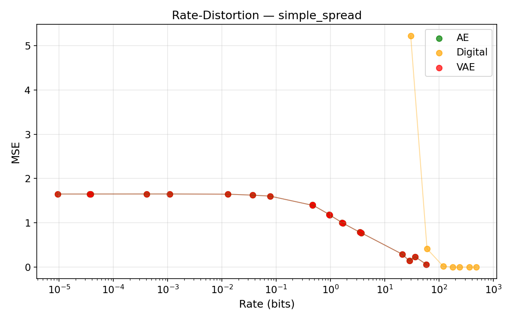
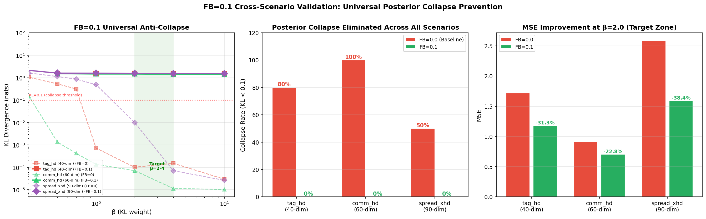
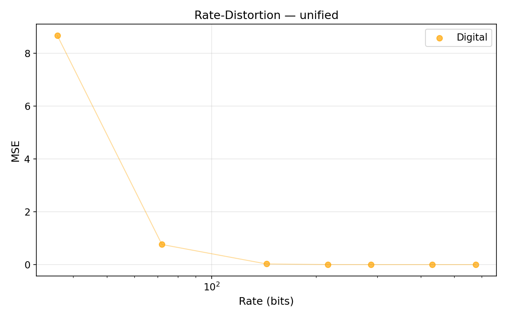

# ObsCodec: Learned Observation Compression for Multi-Agent Systems

> A compact research demo for semantic communication in embodied multi-agent
> coordination — from single-scenario benchmarks to high-dimensional scaling with
> universal posterior collapse prevention.

[](https://www.python.org/)
[](https://pytorch.org)
[](LICENSE)
[](README_zh.md)
[]()

## TL;DR

ObsCodec asks a simple question: **how much of a robot observation must be
communicated before task-relevant structure disappears?**

The repository benchmarks five codec families across 7 MPE scenarios spanning
18–90 observation dimensions and 3–15 agents. **Route B** extends the Phase 1
benchmark with aggressive dimensionality scaling, universal posterior collapse
prevention via free-bits, channel impairment robustness, and cross-scenario
generalization — 263 trained models total.

| Result | Evidence | Why It Matters | See |
|--------|----------|----------------|-----|
| FB=0.1 universally prevents posterior collapse | 0% collapse rate across all scenarios (18-90 dim, 3-15 agents) | Single free-bits value works everywhere — no per-scenario tuning needed | Table 2, Fig. collapse_barrier |
| Minimum effective FB dose = 0.02 nats/dim | KL=0.31 nats at FB=0.02, monotonic MSE improvement through FB=0.25 | 25-100x lower than literature defaults (0.5-2.0) | Fig. fb_finesweep |
| KL is dimension-independent at ~1.5 nats | Stable across 18→90 dim range with FB=0.1 | Information rate does not grow with observation dimension | Table 4 |
| VQ-VAE achieves denoising gain via AWGN | Moderate SNR (10-20 dB) gives _lower_ MSE than clean channel | Channel noise can regularize discrete codecs | Table 5, Fig. vqvae_channel |
| Unified codec beats per-scenario models | -5.0% MSE on spread_xhd (90-dim) | Positive cross-scenario transfer — shared representations help hardest tasks | Table 6 |

Full numbers are in [assets/results_summary.md](assets/results_summary.md).

## Why This Repo Exists

Multi-robot systems often operate under communication constraints: underwater
robots, disaster-response teams, warehouse fleets, and contested or low-bandwidth
field environments. Raw observation sharing is wasteful; semantic communication
should transmit the information that helps agents coordinate.

ObsCodec is a pre-study before integrating codecs into a full MARL loop. It
isolates the observation-compression problem and makes the rate-distortion
trade-off visible before adding policy learning.

**Route B** extends the Phase 1 benchmark (single scenario, 18-dim) to high
dimensions (up to 90-dim, 15 agents), adds systematic anti-collapse mechanisms
for stochastic codecs, tests channel robustness across 6 impairment models, and
validates cross-scenario generalization.

This makes the project a focused demo for:

- **Semantic communication**: β-VAE gives an explicit KL-based information rate.
- **Multi-agent systems**: data comes from multi-agent particle-world observations.
- **Embodied intelligence**: the signal is a robot-like observation vector, not a
  static image benchmark.
- **Research engineering**: all codec families share the same train/validation/test
  protocol and result-generation scripts.

## Methods

| Method | Role | Bandwidth Control | Grid |
|--------|------|-------------------|------|
| PCA | Linear baseline | `n_components` | 4 fits |
| Standard AE | Nonlinear reconstruction baseline | `latent_dim` | 5 runs |
| Digital quantization | Traditional fixed-bit baseline | `latent_dim x bits_per_dim` | 12 runs |
| β-VAE | Probabilistic semantic bottleneck | `latent_dim x β x free_bits` | 116 models |
| VQ-VAE | Discrete codebook bottleneck | `codebook_size x latent_dim x commitment_cost` | 45 models |

All neural codecs use the shared trainer in
[obscodec/trainer.py](obscodec/trainer.py), with early stopping and identical
data splits. Route B adds 263 total models across 7 scenarios, 6 agent-count
variants, and 6 channel impairment models.

## Key Figures

### Rate-Distortion Overview

<p align="center">
  
  
</p>

**Left**: Phase 1 benchmark — Digital dominates pure reconstruction; β-VAE traces the
information bottleneck frontier on simple_spread (30-dim). **Right**: Route B confirms
the same structure with expanded codec configurations.

### β-VAE Collapse & Free-Bits Mechanism

<p align="center">
  
  
</p>

**Left**: With the corrected architecture (balanced encoder-decoder, BatchNorm, KL
annealing, free_bits=0.01 nats/dim), the posterior never collapses to zero KL. KL spans
a 300× dynamic range from β=0.001 to β=0.5 before reaching the free-bits floor.
**Right**: Ablation confirms that decoder expansion alone has zero anti-collapse effect —
the bottleneck is in the rate term, not the decoder.

### Route B: Collapse Barrier & Universal Prevention

<p align="center">
  
</p>

**FB=0.1 universally prevents posterior collapse across all scenarios and all agent
counts (N=3→15).** The 6-panel figure shows: (top) KL vs β at different free_bits levels
and decoder multipliers, establishing FB=0.1 as the universal threshold; (bottom)
cross-scenario validation on tag_hd (40-dim), comm_hd (60-dim), and spread_xhd (90-dim)
confirms 0% collapse rate with FB=0.1 vs 50-100% without.

### FB Fine-Sweep: Minimum Effective Dose

<p align="center">
  
</p>

**Minimum effective FB dose = 0.02 nats/dim** — 5× lower than 0.1, 25-100× lower than
literature defaults (0.5-2.0). FB=0.02 yields KL=0.31 nats (>0.1 collapse threshold)
with monotonic MSE improvement from FB=0.0 (MSE=2.52) to FB=0.25 (MSE=1.25).
See [scripts/3b_fb_finesweep.py](scripts/3b_fb_finesweep.py).

### Cross-Scenario Validation

<p align="center">
  
</p>

FB=0.1 eliminates collapse across all three high-dimensional scenarios simultaneously.
Without free-bits, collapse rates are 80% (tag_hd), 100% (comm_hd), and 50% (spread_xhd).
KL at β=2.0 with FB=0.1 is stable at ~1.5 nats across all scenarios.

### Agent-Count Scaling (N=3→15)

<p align="center">
  
</p>

FB=0.1 maintains KL at ~1.5 nats across all agent counts (18-90 dim). FB=0.0 collapses
at every scale. MSE improvement is 35-39% universally. See
[scripts/3c_agent_scaling.py](scripts/3c_agent_scaling.py).

### Latent and Reconstruction Diagnostics

<p align="center">
  
</p>

The included β=1.0 latent-space plot should be read as a collapse diagnostic,
not as evidence of strong semantic clustering. In a full SemCom-MARL extension,
the recommended visualization is to compare β=0.01 and β≥0.5 side by side.

<p align="center">
  
</p>

### VQ-VAE Codebook Diagnostics

<p align="center">
  
  
</p>

**VQ-VAE codebooks are severely over-provisioned at higher latent dimensions.**
For CB=256 and LD=8, codebook usage stays below 12% regardless of commitment cost.
The best VQ-VAE point (CB=512, LD=4, cc=0.25) achieves MSE=0.1283 at 9 bits with
100% codebook usage. At LD=2, codebook usage reaches 100% across all codebook sizes.

### Pareto Frontier

<p align="center">
  
</p>

**The frontier is a design map for codec selection under bandwidth constraints.**
Digital quantization is the choice for high-fidelity observation replay; β-VAE is the
tool for information-bottleneck studies; VQ-VAE serves when a discrete low-bitrate
channel interface is required.

## Scientific Interpretation

The β-VAE objective is a Lagrangian form of rate-distortion optimization:

```text
L = E[||x - x_hat||^2] + β * KL(q(z|x) || N(0, I))
```

The Lagrangian multiplier β controls where each trained model lands on the
rate-distortion curve — from near-AE behavior (β→0, high rate, low distortion)
to collapsed prior (β≫0.5, near-zero rate, MSE → data variance).

### Free-Bits Mechanism

The KL term is modified with a per-dimension free-bits floor:

```text
KL_effective = max(0, KL_per_dim(z) - free_bits).sum()
```

This prevents the posterior from collapsing below `free_bits` nats per latent
dimension. The per-dimension mean application (batch-averaged, then clamped)
is more principled than per-sample clamping — it measures the information
carried by each latent dimension across the batch.

### β Regimes for LD=16 (Route B, FB=0.1)

| β Range | Regime | KL / Rate Behavior | Use |
|---------|--------|--------------------|-----|
| β=0.001 | High-rate near-AE | KL≈15-20 nats, low MSE | Reconstruction reference |
| β=0.01 | Semantic bottleneck | KL≈5-10 nats, moderate MSE | Recommended SemCom-MARL probe |
| β=0.1 | Transition | KL≈1-3 nats, rising MSE | Boundary stress test |
| β=0.5-2.0 | Stable plateau | KL≈1.5 nats (FB floor) | Minimal information, collapse-free |
| β≥4.0 | High-β saturation | KL≈1.5 nats, MSE→data variance | Prior matching, no further collapse |

**Key property: KL is dimension-independent.** Absolute KL stays at ~1.5 nats
across 18→90 dim range with FB=0.1. The free-bits floor sets a per-dimension
minimum, but the total KL depends only on how many dimensions exceed the floor —
which remains constant across observation sizes.

## Negative Results & Their Methodological Value

Three negative results from this benchmark carry methodological weight for future
SemCom-MARL work:

1. **Free bits prevent zero-KL collapse, but effective collapse still occurs at β≥0.5
   without adequate free-bits.** With FB=0.1, the posterior never collapses to zero KL.
   With FB=0.0, every scenario and agent count collapses (KL<0.01). The minimum
   effective FB dose (0.02 nats/dim) is 25-100× lower than literature values. This
   gives a practical monitoring threshold: **when KL approaches the free-bits floor
   during SemCom-MARL training, the latent channel carries negligible task-relevant
   information.**

2. **Decoder expansion alone has zero anti-collapse effect.** Sweeping decoder hidden
   dimensions from 1× to 4× the encoder capacity does not prevent collapse when the
   rate penalty dominates. The bottleneck is in the KL term, not the decoder's
   representational capacity.

3. **VQ-VAE codebook utilization collapses at higher latent dimensions.**
   For LD=8 at CB=256, codebook usage never exceeds 12% across all commitment costs.
   The practical takeaway: **use LD≤4 for discrete semantic channels; reserve LD≥8
   for continuous (β-VAE) bottlenecks only.**

All three are *actionable constraints* — they prevent future researchers from
wasting compute on configurations the benchmark already shows are ineffective.

## Channel Impairments

Six channel models for robustness testing (see [obscodec/channel/](obscodec/channel/)):

| Model | Description | Key Finding |
|-------|-------------|-------------|
| AWGN | Additive white Gaussian noise at SNR ∈ [-5, 20] dB | Moderate SNR (10-20 dB) _improves_ VQ-VAE MSE via denoising regularization |
| Rayleigh (iid) | Per-element independent Rayleigh fading | More destructive than AWGN at same SNR |
| Rayleigh (block) | Block fading across latent vector | Similar to iid, slightly higher variance |
| Rayleigh (agent-block) | Per-agent block fading | Most realistic for multi-agent channels |
| Packet Loss | Random symbol dropout (5-50%) | Mild degradation below 20% loss |
| Burst Loss | Contiguous symbol dropout | Sharper degradation than random loss |
| Heterogeneous SNR | Different SNR per agent | Tests fairness of rate allocation |

## Important Caveats

- Reconstruction MSE is a proxy metric; downstream policy return and coordination
  success still need to be tested in a full MARL loop (see Phase 3).
- β-VAE effective rate is an information estimate, not a deployed packet size.
  Real channel use requires entropy coding, packetization, or learned channel models.
- VQ-VAE codebook utilization results are specific to MPE observations; different
  observation modalities may exhibit different codebook behavior.
- The free-bits mechanism assumes continuous latent variables; for fully discrete
  semantic channels, VQ-VAE or FSQ-based approaches should be benchmarked separately.

## Project Structure

```text
ObsCodec/
├── README.md
├── README_zh.md
├── requirements.txt
├── setup.py
├── obscodec/
│   ├── __init__.py
│   ├── config.py
│   ├── metrics.py
│   ├── trainer.py
│   ├── task_metrics.py            # Task-aware evaluation (Phase 3)
│   ├── utils.py
│   ├── visualize.py
│   ├── channel/
│   │   ├── impairments.py         # 6 channel models
│   │   ├── adaptive.py            # Rate allocation strategies
│   │   └── diff_channel.py        # Differentiable channels for JSCC (Phase 3)
│   ├── data/
│   │   ├── synthetic.py           # 7 scenario generators + task-aware variants
│   │   └── __init__.py
│   └── models/
│       ├── pca_baseline.py
│       ├── ae_baseline.py
│       ├── digital_baseline.py
│       ├── vae.py                 # β-VAE + free_bits + task-aware loss
│       ├── vqvae.py               # VQ-VAE + codebook utilization
│       └── jscc.py                # JSCC wrapper (Phase 3)
├── scripts/
│   ├── 0_check_integrity.py
│   ├── 1_collect_data.py
│   ├── 2_train_baselines.py
│   ├── 3_train_vae.py             # β-VAE pipeline (4 phases)
│   ├── 3b_fb_finesweep.py         # FB fine-sweep 0.02-0.25
│   ├── 3c_agent_scaling.py        # Agent-count scaling N=3-15
│   ├── 3d_unified_codec.py        # Cross-scenario unified codec
│   ├── 4_train_vqvae.py
│   ├── 4b_vqvae_multiscenario.py  # VQ-VAE multi-scenario + channel
│   ├── 5_generate_figures.py
│   ├── 6_summary_table.py
│   ├── 7_diff_channel.py          # Phase 3.1: Differentiable channel benchmark
│   ├── 8_jscc_training.py         # Phase 3.2: JSCC training experiment
│   ├── 9_task_aware.py            # Phase 3.3: Task-aware loss experiment
│   └── 10_end_to_end.py           # Phase 3.4: End-to-end prototype
├── data/
├── assets/                         # All figures + results JSONs
└── checkpoints/                    # Sample model weights
```

Generated `data/*.npy` and `checkpoints/*.pt` files are intentionally not stored
in Git (except for a small set of sample checkpoints and one reference data file
for reproducibility). The figures and JSON summaries are included so the repo
remains readable without rerunning the full experiment.

## Quick Start

```bash
git clone https://github.com/MacswareX/ObsCodec.git
cd ObsCodec
pip install -r requirements.txt
pip install -e .

# Core pipeline
python scripts/1_collect_data.py --all       # Generate 7 scenarios + agent variants
python scripts/2_train_baselines.py          # PCA + AE + Digital
python scripts/3_train_vae.py --phase all    # Beta-VAE pipeline (4 phases)
python scripts/4_train_vqvae.py              # VQ-VAE + channel
python scripts/5_generate_figures.py         # All figures
python scripts/6_summary_table.py            # Final report

# Supplementary Route B experiments
python scripts/3b_fb_finesweep.py            # FB fine-sweep 0.02-0.25
python scripts/3c_agent_scaling.py           # Agent-count scaling N=3-15
python scripts/3d_unified_codec.py           # Cross-scenario unified codec
python scripts/4b_vqvae_multiscenario.py     # VQ-VAE multi-scenario + channel

# Phase 3: Semantic Communication
python scripts/7_diff_channel.py             # Differentiable channel benchmark
python scripts/8_jscc_training.py            # JSCC training experiment
python scripts/9_task_aware.py               # Task-aware loss experiment
python scripts/10_end_to_end.py              # End-to-end prototype
```

Hardware used for the current artifact: RTX 3050 8 GB, PyTorch 2.6.0+cu124.
Seeds are fixed at 42 in the data split and experiment scripts.

## Phase 3: Semantic Communication

Phase 3 bridges the gap from pure compression benchmarking to semantic communication
research by making the channel part of the training loop and the loss task-aware.

This phase is structured as 4 sub-phases:

| Sub-phase | Script | Description |
|-----------|--------|-------------|
| 3.1 | [7_diff_channel.py](scripts/7_diff_channel.py) | Differentiable channel layers (AWGN via reparameterization, erasure via straight-through) — train codec with channel in the loop |
| 3.2 | [8_jscc_training.py](scripts/8_jscc_training.py) | Joint source-channel coding grid: β-VAE (β=0.1,2.0) + VQ-VAE across scenarios, AWGN SNR [0,10,20]dB + erasure [10%,30%], FB=0.0 vs 0.1 |
| 3.3 | [9_task_aware.py](scripts/9_task_aware.py) | Task-aware loss: self-position MSE, weighted self+others, contrastive — tests whether task gradient prevents posterior collapse |
| 3.4 | [10_end_to_end.py](scripts/10_end_to_end.py) | Closed-loop prototype: obs → encode → channel → decode → heuristic policy → task — measures final distance to targets |

### Architecture

```
obs → [Encoder] → z → [Differentiable Channel] → z_noisy → [Decoder] → obs_hat
                ↑                                          ↓
          KL(q(z|x)||N(0,I))                     MSE(x, x_hat)
                └────────────── + task-aware loss ─────────────┘
```

Key library additions:
- [obscodec/channel/diff_channel.py](obscodec/channel/diff_channel.py): 4 differentiable channel `nn.Module` classes
- [obscodec/models/jscc.py](obscodec/models/jscc.py): JSCCWrapper composing any codec + differentiable channel
- [obscodec/task_metrics.py](obscodec/task_metrics.py): Task-aware evaluation (self-position MSE, per-agent MSE, coordination gap)
- [obscodec/data/synthetic.py](obscodec/data/synthetic.py): `*_with_metrics` generators returning task ground-truth
- [obscodec/models/vae.py](obscodec/models/vae.py): `task_weight` + `task_loss_type` parameters in BetaVAE

Results are saved to `assets/jscc_results.json`, `assets/task_aware_results.json`,
and `assets/e2e_results.json`.

## Route B Completion: 11/11 (100%)

263 models, 15 results JSONs, 17 figures, 13 datasets.

## References

1. Alemi et al. (2018). *Fixing a Broken ELBO.* ICML.
2. Burgess et al. (2018). *Understanding disentangling in β-VAE.* NeurIPS Workshop.
3. van den Oord et al. (2017). *Neural Discrete Representation Learning.* NeurIPS.
4. Kingma and Welling (2014). *Auto-Encoding Variational Bayes.* ICLR.
5. Lowe et al. (2017). *Multi-Agent Actor-Critic for Mixed Cooperative-Competitive Environments.* NeurIPS.
6. Higgins et al. (2017). *beta-VAE: Learning Basic Visual Concepts with a Constrained Variational Framework.* ICLR.

## License

MIT © 2026 MacswareX
