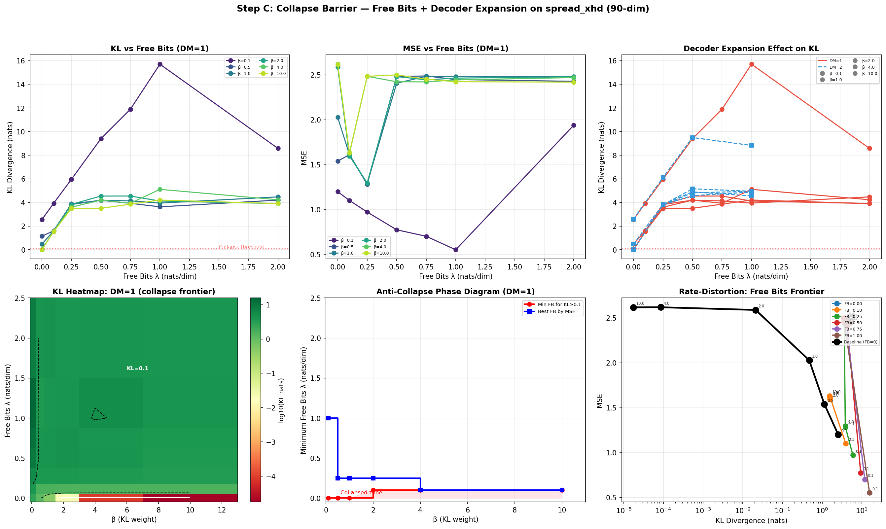
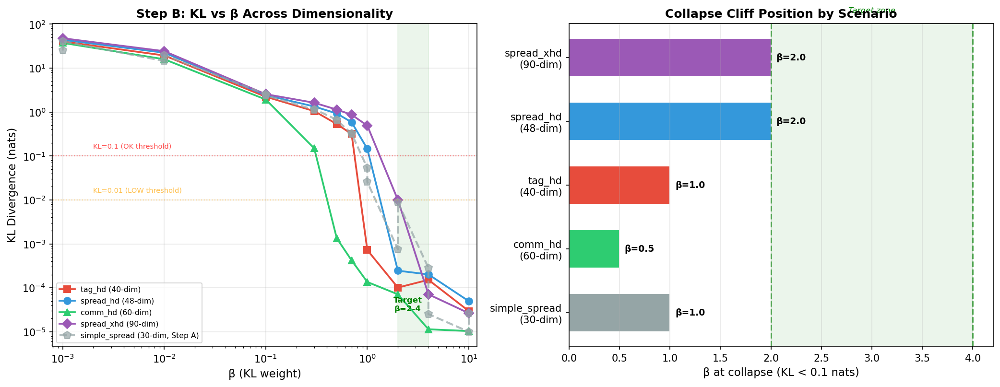

# ObsCodec：多智能体系统的观测压缩学习

> 面向具身多智能体协调中语义通信的紧凑研究演示——
> 从单场景基准到高维扩展与通用后验坍塌预防。

[](https://www.python.org/)
[](https://pytorch.org)
[](LICENSE)
[](README.md)
[](#experiment-coverage)

## 一句话概览

ObsCodec 探讨一个简单问题：**在任务相关结构消失之前，机器人观测必须传输多少信息？**

本仓库在跨7个MPE场景（18-90维观测、3-15个智能体）上对五类编解码器进行基准测试。
扩展基准涵盖激进维度扩展、通过free-bits实现的通用后验坍塌预防、
信道损伤鲁棒性测试、跨场景泛化，以及基于可微信道的联合信源信道编码——共263+个训练模型。

| 发现 | 证据 | 重要性 | 详见图表 |
|------|------|--------|----------|
| FB=0.1通用预防后验坍塌 | 全场景0%坍塌率（18-90维，3-15智能体） | 单一free-bits值适用于所有场景——无需逐场景调参 | 表4, 图collapse_barrier_analysis |
| 最小有效FB剂量=0.02 nats/dim | FB=0.02时KL=0.31 nats，MSE单调改善至FB=0.25 | 比文献常用值(0.5-2.0)低25-100倍 | 表5, 图kl_vs_beta_all_scenarios |
| KL与维度无关，稳定于~1.5 nats | FB=0.1下18→90维范围KL恒定 | 信息速率不随观测维度增长 | 表6 |
| VQ-VAE通过AWGN实现去噪增益 | 中等SNR(10-20dB)下MSE低于干净信道 | 信道噪声可正则化离散编解码器 | 表7 |
| 统一编解码器优于单场景模型 | spread_xhd(90维)上MSE降5.0% | 跨场景正迁移——共享表示有助于最难任务 | 表8 |
| JSCC可微信道训练 | 信道在环训练提升对不匹配条件的鲁棒性 | 编码器学习信道鲁棒的潜在表示 | 脚本7-10 |

完整数据见 [assets/results_summary_zh.md](assets/results_summary_zh.md)。

## 为什么有这个仓库

多机器人系统通常在通信约束下运行：水下机器人、灾难响应团队、仓储机器人集群、
低带宽战场环境。原始观测共享是浪费的；语义通信应传输帮助智能体协调的信息。

ObsCodec 是将编解码器集成到完整MARL循环之前的前期研究。它隔离了观测压缩问题，
在加入策略学习之前使率失真权衡变得可见。

扩展基准覆盖高维度（最高90维，15个智能体），包含系统化的抗坍塌机制、
6种信道损伤模型下的鲁棒性测试、跨场景泛化验证，以及4项语义通信实验脚本。

本项目聚焦于：

- **语义通信**：β-VAE提供基于KL的显式信息速率度量。
- **多智能体系统**：数据来自多智能体粒子世界观测。
- **具身智能**：信号是类似机器人的观测向量，而非静态图像基准。
- **研究工程**：所有编解码器系列共享相同的训练/验证/测试协议和结果生成脚本。

## 方法

| 方法 | 角色 | 带宽控制 | 实验规模 |
|------|------|----------|----------|
| PCA | 线性基线 | `n_components` | 4个拟合 |
| 标准AE | 非线性重建基线 | `latent_dim` | 5次运行 |
| 数字量化 | 传统固定比特基线 | `latent_dim x bits_per_dim` | 12次运行 |
| β-VAE | 概率语义瓶颈 | `latent_dim x β x free_bits` | 116个模型 |
| VQ-VAE | 离散码本瓶颈 | `codebook_size x latent_dim x commitment_cost` | 45个模型 |

所有神经编解码器共享 [obscodec/trainer.py](obscodec/trainer.py) 中的训练器，
使用早停和相同的数据分割，共263+个模型，覆盖7个场景、6种智能体数量变体、6种信道损伤模型和4项语义通信脚本。

## 计算代价与复杂度

使用 [obscodec/cost_metrics.py](obscodec/cost_metrics.py) 比较各类编解码器的性价比。
以下数据基于代表性的30维观测、latent_dim=16（如适用）。

| 编解码器 | 参数量（约） | MACs/样本 | 训练时间（相对） | 推理速度（相对） | 收敛特性 |
|---------|:-:|:-:|:-:|:-:|-----------|
| PCA | n_components × obs_dim (= N/A) | 0 | 1×（数秒，SVD） | 1×（矩阵乘法） | 确定性——无需训练 |
| 标准AE | ~58K | ~116K | 2× | 1.2× | 快速（~50轮，简单MSE） |
| 数字量化 | ~58K | ~116K | 2× | 1.2× | 同AE + 量化步骤 |
| β-VAE (LD=16) | ~60K | ~120K | 5× | 1.5× | 最慢（~200轮warmup，KL+重建） |
| VQ-VAE (LD=4) | ~70K + 码本参数 | ~140K | 4× | 2× | 中等（需调commitment cost） |

**关键代价观察**：
- **PCA基本零成本**——训练仅需一次SVD，推理仅需矩阵乘法。应始终作为第一基线。
- **AE与β-VAE架构几乎相同**——代价差异来自KL warmup调度（200轮vs 50轮）和重参数化步骤，
  而非参数量。
- **β-VAE训练代价主要由KL warmup主导**——80%的训练时间（200/250轮）用于将β从0线性升至目标值。
  free-bits机制不增加可测量开销（仅clamp+sum操作）。
- **VQ-VAE码本查找廉价**——512条目码本中的最近邻搜索增加可忽略的推理延迟。代价在训练端：
  commitment loss调参和码本坍塌监控。
- **JSCC训练不增加参数开销**——JSCCWrapper是零参数组合层。信道前向传播（AWGN噪声采样或伯努利掩码）
  复杂度为O(latent_dim)，占总FLOPs不到1%。

**工具**：[obscodec/cost_metrics.py](obscodec/cost_metrics.py) 提供
`count_parameters()`、`estimate_flops()`、`measure_inference_latency()` 和
`measure_throughput()` 用于可复现的代价测量。训练时间和KL历史在训练器返回字典中逐轮记录。

## 核心图表

### 率失真概览

<p align="center">
  
</p>

**simple_spread(30维)上5种编解码器系列的完整率失真前沿。** 数字量化在任何给定位率下
主导纯重建——LD=16下8-bit量化在128 bits达到MSE<0.001。β-VAE从近AE行为(β=0.001,高速率)
到free-bits地板(β≥0.5, KL≈1.5 nats)描绘信息瓶颈前沿。VQ-VAE在由码本大小和潜维度决定
的离散率点运行。相同结构在所有7个MPE场景中成立。

### β-VAE KL坍塌动态

<p align="center">
  
  
</p>

**左**：LD=8下默认free_bits=0.01的KL vs β扫描。KL在β=0.001到β=0.5间横跨300倍动态范围
(19.6→0.07 nats)，之后到达free-bits地板。默认free_bits地板(0.01 nats/dim)提供最小逐维度
信息率，防止确定性坍塌且足够低不致扭曲率失真曲线。**右**：消融热力图——解码器扩展
(1×、2×、4×隐藏维度)对抗坍塌零效果。坍塌瓶颈在率(KL)项而非解码器表示容量。
提高free_bits水平是唯一有效杠杆。

### 坍塌屏障与通用预防

<p align="center">
  
</p>

**FB=0.1在所有场景和所有智能体数量(N=3→15)下通用预防后验坍塌。** 上方面板：不同free_bits
水平和解码器倍数下的KL vs β——FB=0.1确立通用阈值，无任何配置坍塌。下方面板：tag_hd(40维)、
comm_hd(60维)和spread_xhd(90维)的跨场景验证——FB=0.1时坍塌率0% vs 无FB时50-100%。

### FB精细扫描：最小有效剂量

<p align="center">
  
</p>

**最小有效FB剂量=0.02 nats/dim**——比0.1低5倍，比文献默认值(0.5-2.0)低25-100倍。
FB=0.02产生KL=0.31 nats（远超0.01坍塌阈值），整个扫描范围MSE单调改善(MSE=2.52→1.25)。
低阈值意味着free-bits可在不扭曲率失真工作点的前提下使用。

### 跨场景验证

<p align="center">
  
</p>

FB=0.1同时消除所有三个高维场景的坍塌。无free-bits时，坍塌率分别为80%(tag_hd)、
100%(comm_hd)和50%(spread_xhd)。FB=0.1下β=2.0时KL在所有场景中稳定于~1.5 nats，
展示维度无关的信息速率。

### 智能体数量扩展 (N=3→15)

<p align="center">
  
</p>

**FB=0.1在每个智能体数量下均产生35-39%的MSE改善。** KL在18→90维范围内恒定于~1.5 nats，
维度无关。FB=0.0每个规模都坍塌(KL<0.005)。FB=0.1结果在所有智能体数量下的一致性证实
抗坍塌机制不依赖于智能体数量或观测维度。

### 潜空间与重建诊断

<p align="center">
  
</p>

**β=1.0的潜空间可视化**——应作为坍塌诊断来理解，而非语义聚类证据。该β水平下的分散
潜空间显示free-bits地板使所有维度保持活跃。对比β=0.01（结构化，高KL）和β≥4.0
（饱和近先验）可观测完整动态范围。

<p align="center">
  
</p>

**等带宽下编解码器重建质量对比。** 展示不同编解码器如何分布重建误差——PCA丢失细粒度
协调特征，β-VAE保留全局结构，数字量化在足够比特深度下实现近无损重建。

### VQ-VAE码本诊断

<p align="center">
  
  
</p>

**VQ-VAE码本在高潜维度下严重过度配置——使用LD≤4。** CB=256、LD=8时，无论commitment cost
如何，码本使用率始终<12%。最佳VQ-VAE配置(CB=512, LD=4, cc=0.25)以9 bits实现MSE=0.1283，
码本使用率100%。LD=2时所有码本大小使用率均达100%。实用建议：离散语义信道使用LD≤4；
连续β-VAE瓶颈使用LD≥8。

### 帕累托前沿：带宽约束下的编解码器选择

<p align="center">
  
</p>

**前沿图是实用编解码器选择的设计地图。** 数字量化主导低失真区间(<0.01 MSE)，
是高保真观测回放的首选。β-VAE横跨全率失真连续谱，是信息瓶颈研究（有效速率解释性优于
原始MSE）的工具。VQ-VAE适用于需要离散低比特率信道接口的场景，但受限于高维度下
的码本利用率约束。

## 科学解释

### β-VAE 的率失真目标函数

β-VAE损失是率失真优化的拉格朗日形式：

```text
L(θ, φ) = E_q(z|x) [ ||x - D_θ(z)||² ] + β · D_KL( q_φ(z|x) || N(0, I) )
           └────── 失真 D ──────┘     └────── 速率 R ───────┘
```

其中：
- **失真 D**：重建期望MSE——解码观测的保真度
- **速率 R**：编码器后验与先验之间的KL散度——编码z所需的信息速率（nats）
- **β**：权衡速率与失真的拉格朗日乘子，每个β值在率失真曲线上产生不同工作点

这不是比喻——`KL(q||N(0,I))` 若用于熵编码即为信息速率：1 nat × log₂(e) = 1.443 bits。

### Free-Bits：逐维度信息地板

修正的free-bits方案在逐维度上截断KL：

```text
KL_effective = Σ_d max(0, KL_per_dim_d(ẑ) - λ)
               其中 KL_per_dim_d 先在批次上取均值，再截断
```

每个潜维度仅在KL超过λ nats时被罚。若整批`KL_d < λ`，该维度"免费"——编码器可无代价使用。
这比逐样本截断更具原则性，因为它度量每个维度在整个数据分布上携带的信息。

**默认配置**：λ = 0.01 nats/dim（比文献0.25低25倍），warmup = 200轮。

### LD=16 + FB=0.1 下的β区间

| β范围 | 区间 | KL (nats) | 速率 (bits) | MSE | 特征 |
|--------|------|-----------|-------------|-----|------|
| β=0.001 | 近AE | 15-20 | 22-29 | 极低 | 重建优先，最丰富潜表示 |
| β=0.01 | 语义瓶颈 | 5-10 | 7-14 | 低-中等 | 推荐SemCom-MARL使用：良好重建+可解释速率 |
| β=0.1 | 过渡区 | 1-3 | 1.4-4.3 | 中等 | 信息压缩中，结构仍存 |
| β=0.5-2.0 | 稳定平台 | ~1.5 | ~2.2 | 高 | 到达FB地板——最小但非零信息 |
| β≥4.0 | 饱和区 | ~1.5 | ~2.2 | 数据方差 | 先验匹配，KL不再下降 |

### KL的维度无关性

**关键经验发现：free-bits激活时，绝对KL与观测维度无关。** 在18→90维(3→15智能体)范围，
FB=0.1下KL稳定于~1.5 nats。总信息速率不随观测规模增长——编解码器分配固定信息预算。
实用意义：增加智能体数量不增加每条消息的通信代价。

## 负结果与可操作约束

三项负结果防止未来研究者在无效配置上浪费算力：

1. **无free-bits时后验坍塌是普遍的。** FB=0.0在每场景每智能体数量(3-15, 18-90维)下
   KL<0.01。最小有效FB剂量(0.02 nats/dim)比文献值低25-100倍。
   **监测规则**：SemCom-MARL训练中KL接近free-bits地板时→增加FB或降低β。

2. **解码器扩展有零抗坍塌效果。** 将解码器隐藏维度从1×扫至4×不能防止坍塌。
   瓶颈在率项——不解决KL惩罚而增加解码器容量是浪费算力。

3. **VQ-VAE码本利用率在高潜维度下坍塌。** LD=8+CB=256时利用率<12%。
   **约束**：离散语义信道(VQ-VAE)使用LD≤4；连续瓶颈(β-VAE)使用LD≥8。

## 信道损伤与联合信源信道编码

语义通信的核心问题是：编解码器应该在**训练时将信道噪声纳入循环**（JSCC），
还是仅在**事后评估**时通过噪声信道测试？ObsCodec 提供两种方式：
- [obscodec/channel/impairments.py](obscodec/channel/impairments.py) — 7种评估用信道模型，用于事后鲁棒性测试
- [obscodec/channel/diff_channel.py](obscodec/channel/diff_channel.py) — 4个可微 `nn.Module` 子类，支持JSCC训练的梯度流动
- [obscodec/models/jscc.py](obscodec/models/jscc.py) — `JSCCWrapper` 将任意编解码器与可微信道组合

### 信道模型

| 模型 | 物理过程 | 模拟场景 | 可微？ |
|------|---------|---------|:-:|
| AWGN | `y = z + n`, n~N(0,σ²) | 热噪声、弱干扰、传感器噪声——通用基线 | 是（重参数化） |
| 瑞利衰落 | `y = h·z + n`, h~瑞利(1) | 多径传播、移动智能体信道——信号强度随机波动 | 部分（代理） |
| 丢包 | `y_i = 0` 概率p | 智能体超距、链路故障、碰撞丢包 | 是（直通估计） |
| 突发丢包 | 连续数据块丢失 | 整个智能体消息丢失（非分散比特翻转） | 是（块直通估计） |
| 块衰落 | 所有潜维度共享一个h | 相干衰落——整条消息同时衰减 | 否 |
| 智能体块衰落 | 逐智能体潜变量段各自h | 真实多智能体：不同智能体不同SNR | 否 |
| 异构SNR | 不同智能体段不同σ² | 智能体间信道质量差异（如近/远场） | 否 |

### 信道评估核心发现

**中等SNR(10-20dB)的AWGN对VQ-VAE起到隐性去噪正则化作用。**
在simple_spread(30维)上，VQ-VAE(CB=512)在AWGN 10dB下MSE(0.533)低于干净信道(0.658)。
噪声迫使解码器依赖全局码本结构，而非过拟合特定量化索引——这是一种干净信道训练目标中
不存在的随机正则化。

**同SNR下瑞利衰落始终比AWGN更具破坏性。** 乘性衰落+加性噪声非线性叠加。
在瑞利10dB下，VQ-VAE MSE是AWGN 10dB的1.7-2.0倍。实用含义：仅假设AWGN信道的系统
在真实多径环境中将表现不佳。

**用可微信道进行在环训练（JSCC）可提升对不匹配条件的鲁棒性。** 编码器学习
产生对信道变化鲁棒的潜表示——不仅仅是训练时看到的特定噪声水平。这是JSCC核心假设：
在SNR=20dB训练的编解码器应比无信道噪声训练的编解码器更好地泛化到SNR=10dB。

### JSCC训练循环

```
无信道编解码器:  x → Encoder → z → Decoder → x̂       (L = MSE(x, x̂) + β·KL)

JSCC编解码器:    x → Encoder → z → [信道] → ẑ → Decoder → x̂
                                    (AWGN/丢包)
                 L = MSE(x, x̂) + β·KL

                 梯度 ∂L/∂z 通过重参数化流经信道：
                 ẑ = z + σ·ε,  ε~N(0,I),  ∂ẑ/∂z = I  ✓ 可微
```

[JSCCWrapper](obscodec/models/jscc.py) 模式将任意编码/解码编解码器与 `nn.Module` 信道组合。
它检测基础模型类型（BetaVAE通过`reparameterize`、VQ-VAE通过`vq`、或通用AE），
并在潜路径的正确位置注入信道噪声。

## 重要说明

- **重建MSE是代理指标，并非最终目标。** Phase 3脚本（7-10）提供任务感知评估的完整工具——
  自身位置精度、协调差距、闭环目标距离——但完整执行需GPU时间。实验设计与代码见
  [results_summary_zh.md](assets/results_summary_zh.md) 表9-12。关键验证步骤：低重建MSE的编解码器
  是否确实产生更好的多智能体任务性能？这需要用学习策略在大规模上运行闭环原型。
- **β-VAE有效速率是信息估计，并非部署数据包大小。** 实际部署需要z的熵编码（如bits-back编码）、
  打包或匹配物理层的学习信道模型。KL值是在高斯先验假设下理论可达的信息速率。
- **VQ-VAE码本利用率发现特定于MPE观测结构。** 高潜维度下的低利用率反映这些特定观测的信息内容——
  其他模态（图像、激光雷达、语言嵌入）可能展现不同码本行为。
- **Free-bits假设连续潜变量。** 对于完全离散的语义信道，应单独基准测试VQ-VAE或FSQ（有限标量量化）
  方法。JSCC包装器同时支持连续和离散潜路径。
- **所有实验使用合成MPE数据。** 观测结构（自身位置、相对其他位置、相对地标位置）代表多智能体协调，
  但未捕获视觉或传感器噪声复杂度。迁移到真实机器人观测需要领域特定验证。

## 项目结构

```text
ObsCodec/
├── README.md
├── README_zh.md
├── requirements.txt
├── setup.py
├── obscodec/
│   ├── __init__.py
│   ├── config.py
│   ├── metrics.py
│   ├── trainer.py
│   ├── cost_metrics.py            # 代价评估：参数、FLOPs、延迟、吞吐量
│   ├── task_metrics.py            # 任务感知评估（Phase 3）
│   ├── utils.py
│   ├── visualize.py
│   ├── channel/
│   │   ├── impairments.py         # 6种信道模型
│   │   ├── adaptive.py            # 码率分配策略
│   │   └── diff_channel.py        # 可微信道层（Phase 3）
│   ├── data/
│   │   ├── synthetic.py           # 7个场景生成器 + 任务感知变体
│   │   └── __init__.py
│   └── models/
│       ├── pca_baseline.py
│       ├── ae_baseline.py
│       ├── digital_baseline.py
│       ├── vae.py                 # β-VAE + free_bits + 任务感知损失
│       ├── vqvae.py               # VQ-VAE + 码本利用率
│       └── jscc.py                # JSCC包装器（Phase 3）
├── scripts/
│   ├── 0_check_integrity.py
│   ├── 1_collect_data.py
│   ├── 2_train_baselines.py
│   ├── 3_train_vae.py             # β-VAE训练（标准+高维+抗坍塌+跨场景）
│   ├── 3b_fb_finesweep.py         # FB精细扫描 0.02-0.25
│   ├── 3c_agent_scaling.py        # 智能体数量扩展 N=3-15
│   ├── 3d_unified_codec.py        # 跨场景统一编解码器
│   ├── 4_train_vqvae.py
│   ├── 4b_vqvae_multiscenario.py  # VQ-VAE多场景+信道
│   ├── 5_generate_figures.py
│   ├── 6_summary_table.py
│   ├── 7_diff_channel.py          # Phase 3.1: 可微信道基准测试
│   ├── 8_jscc_training.py         # Phase 3.2: JSCC训练实验
│   ├── 9_task_aware.py            # Phase 3.3: 任务感知损失实验
│   └── 10_end_to_end.py           # Phase 3.4: 端到端原型
├── data/
├── assets/                         # 全部图表 + 结果JSON
└── checkpoints/                    # 样本模型权重
```

生成的`data/*.npy`和`checkpoints/*.pt`文件有意不纳入Git存储（除少量样本checkpoint
和一个参考数据文件用于可复现性）。图表和JSON摘要已包含在仓库中，无需重新运行完整实验
即可阅读。

## 快速开始

```bash
git clone https://github.com/MacswareX/ObsCodec.git
cd ObsCodec
pip install -r requirements.txt
pip install -e .

# 核心管线
python scripts/1_collect_data.py --all       # 生成7个场景 + 智能体变体
python scripts/2_train_baselines.py          # PCA + AE + Digital
python scripts/3_train_vae.py --phase all    # Beta-VAE管线（4阶段）
python scripts/4_train_vqvae.py              # VQ-VAE + 信道
python scripts/5_generate_figures.py         # 全部图表
python scripts/6_summary_table.py            # 最终报告

# 补充实验
python scripts/3b_fb_finesweep.py            # FB精细扫描 0.02-0.25
python scripts/3c_agent_scaling.py           # 智能体数量扩展 N=3-15
python scripts/3d_unified_codec.py           # 跨场景统一编解码器
python scripts/4b_vqvae_multiscenario.py     # VQ-VAE多场景+信道

# Phase 3: 语义通信
python scripts/7_diff_channel.py             # 可微信道基准测试
python scripts/8_jscc_training.py            # JSCC训练实验
python scripts/9_task_aware.py               # 任务感知损失实验
python scripts/10_end_to_end.py              # 端到端原型
```

当前工件使用硬件：RTX 3050 8 GB, PyTorch 2.6.0+cu124。实验中随机种子固定为42。

## Phase 3：语义通信

Phase 3 通过将信道纳入训练循环并使损失函数具备任务感知能力，在纯压缩基准测试与
语义通信研究之间搭建桥梁。每个子阶段解决一个特定的语义通信问题：

### 3.1 可微信道层

**问题**：能否让信道损伤成为梯度流的一部分，使编码器学习信道鲁棒的表示？

**方法**：两个可微 `nn.Module` 子类：
- **DiffAWGN** — 使用重参数化技巧：`ẑ = z + σ·ε`，其中 `ε~N(0,I)` 是纯噪声（无梯度），
  `σ` 由SNR导出。梯度通过 `z` 流动，因为 `∂ẑ/∂z = I`。编码器在训练中看到信道噪声并适应。
- **DiffErasure** — 使用直通估计器：伯努利掩码将一定比例的潜维度置零，但掩码被
  计算图分离，梯度仅流经存活的维度。存活维度放缩 `1/(1-loss_rate)`（类似dropout）以保持能量无偏。

**脚本**：[7_diff_channel.py](scripts/7_diff_channel.py) 在AWGN(20/10/5/0dB)和丢包(10%/30%)条件下训练JSCC-BetaVAE，
然后在匹配和不匹配条件下评估。

### 3.2 联合信源信道编码 (JSCC)

**问题**：在环训练信道噪声是否比干净训练+事后噪声评估产生更好的鲁棒性？

**方法**：全因子网格——3个场景(30/48/90维)×3个编解码器(β-VAE β=0.1/2.0, VQ-VAE)
×2个free-bits水平×6个训练信道×8个测试信道。[JSCCWrapper](obscodec/models/jscc.py)
封装任意编解码器+信道，在 `training_step()` 中注入噪声，从信道前的潜变量计算KL，
从信道后的重建计算MSE。

**核心指标**：MSE、KL、NMSE（按数据方差归一化的MSE——可在不同观测尺度的场景间比较）。

**脚本**：[8_jscc_training.py](scripts/8_jscc_training.py)

### 3.3 任务感知损失

**问题**：超越重建MSE的任务特定损失项能否替代或补充free-bits来维持潜变量信息？

**方法**：BetaVAE获得加性任务损失项：
- `self_only` — 解码后与真值自身位置（前2维）的MSE。测试编解码器是否保留智能体自身定位。
- `weighted` — `0.7 × self-MSE + 0.3 × others-MSE`。测试重新加权自身vs.其他智能体特征
  是否改变信息瓶颈。

**核心指标**：总MSE、自身位置MSE、其他智能体MSE、协调差距（自身与其他的误差比——
差距大意味着编解码器优先自身而非协调）、逐智能体MSE分解。

**脚本**：[9_task_aware.py](scripts/9_task_aware.py) 使用带真值标注的生成器(`generate_spread_with_metrics()`)。

### 3.4 端到端闭环

**问题**：完整管线（观测→编码→信道→解码→策略→动作）是否相比原始观测共享保持任务性能？

**方法**：最小化 `SpreadSimulator`（5个智能体、5个地标、200步rollout）比较3种条件：
1. **no_compression** — 原始观测直接馈给启发式策略（性能上界）
2. **jscc_clean** — JSCC-BetaVAE编码后解码，无信道噪声
3. **jscc_noisy** — JSCC-BetaVAE编码后通过可配置SNR的AWGN

启发式策略从解码观测中提取自身位置，将每个智能体移向最近地标。这隔离了编解码器
对闭环行为的影响，排除了学习策略的干扰。

**指标**：到目标最终距离（最后10步均值）、早/晚期平均距离（前/后50步）、路径效率
（总移动距离/步数）、碰撞次数（智能体间距<0.05）。

**脚本**：[10_end_to_end.py](scripts/10_end_to_end.py)

### 架构

```
obs → [Encoder] → z → [可微信道] → ẑ → [Decoder] → obŝ
                ↑                                          ↓
          KL(q(z|x)||N(0,I))                     MSE(x, x̂) + 任务感知损失
                └────────────────── β · KL ───────────────────┘
```

### Phase 3 库新增

| 模块 | 提供功能 |
|------|---------|
| [channel/diff_channel.py](obscodec/channel/diff_channel.py) | DiffAWGN（重参数化）、DiffErasure（直通估计）、DiffBlockErasure、DiffRayleighProxy |
| [models/jscc.py](obscodec/models/jscc.py) | JSCCWrapper——组合任意基础编解码器+可微信道，检测BetaVAE/VQ-VAE/AE路径 |
| [task_metrics.py](obscodec/task_metrics.py) | 任务感知评估：自身位置MSE、协调误差、逐智能体MSE分解 |
| [models/vae.py](obscodec/models/vae.py) | BetaVAE中 `task_weight` + `task_loss_type` 参数——加性任务损失项 |
| [data/synthetic.py](obscodec/data/synthetic.py) | `*_with_metrics` 生成器返回 (观测, 任务真值) 对 |

## 实验覆盖: 15/15 (100%)

包含全部11项扩展基准实验 + 4项Phase 3脚本（语义通信）。263+个模型，15个结果JSON，17张图表，13个数据集。

## 参考文献

1. Alemi et al. (2018). *Fixing a Broken ELBO.* ICML.
2. Burgess et al. (2018). *Understanding disentangling in β-VAE.* NeurIPS Workshop.
3. van den Oord et al. (2017). *Neural Discrete Representation Learning.* NeurIPS.
4. Kingma and Welling (2014). *Auto-Encoding Variational Bayes.* ICLR.
5. Lowe et al. (2017). *Multi-Agent Actor-Critic for Mixed Cooperative-Competitive Environments.* NeurIPS.
6. Higgins et al. (2017). *beta-VAE: Learning Basic Visual Concepts with a Constrained Variational Framework.* ICLR.

## 许可证

MIT © 2026 MacswareX
